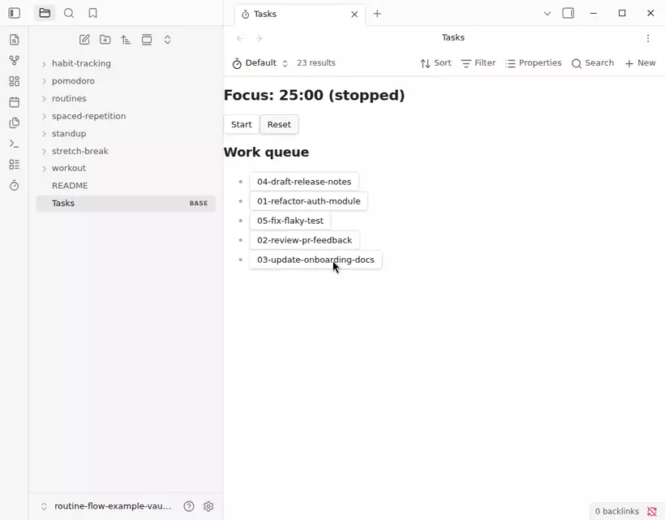
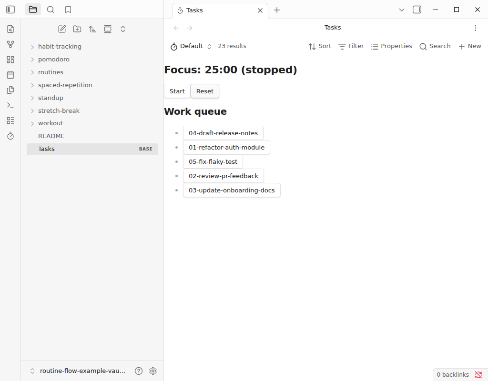
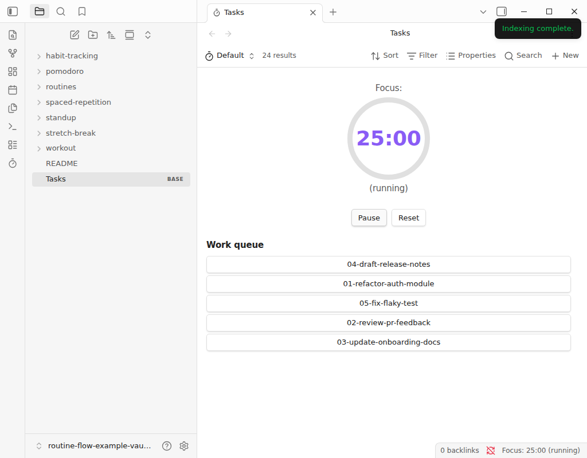

# Routine Flow

A customizable routine timer for Obsidian, built as a native [Bases](https://help.obsidian.md/bases) view.
The underlying model is a generic phase graph, not a hardcoded 25/5 cycle — a "routine" note can describe any sequence of timed or rep-based phases (a workout, a standup, a study block), so the timer isn't limited to classic Pomodoro.

Full docs, including a getting-started walkthrough, live at the [documentation site](https://mkobit.github.io/routine-flow/).

## Features

- Adds a "Routine Timer" view type to Obsidian Bases, alongside the built-in Table/Cards views.
- Work and break queues are driven by the Base's own query — filter which notes count as "focus" or "break" tasks via a configured property/value pair.
- Optional custom routines: point a view at a note whose frontmatter includes `is-routine: true` to define an alternate phase graph, instead of the default focus/break cycle.
- Write-back on completion: increments a configurable frontmatter property (default `sessions`) on the active note when a phase finishes.

## Requirements

- Obsidian 1.12.7 or later.
- Desktop only.

## Installation

This plugin isn't yet listed in Obsidian's community plugin directory.
Until then, install manually or via [BRAT](https://github.com/TfTHacker/obsidian42-brat):

1. Download `main.js`, `manifest.json`, and `styles.css` from the [latest release](../../releases).
2. Copy them into `<your-vault>/.obsidian/plugins/routine-flow/`.
3. Reload Obsidian and enable "Routine Flow" under Settings → Community plugins.

## Usage

See the [getting-started walkthrough](https://mkobit.github.io/routine-flow/getting-started) for the full install→configure→run path.

Quick start: add a Routine Timer view to a `.base` file, set the focus/break task property and value to match your notes' frontmatter, then click **Start**.

## Screenshots

The Routine Timer view, idle and running:

The [screenshot gallery](https://mkobit.github.io/routine-flow/screenshots) has the rest — side panel, status bar, settings tab, and the confirmation modals.

## Development

See [AGENTS.md](AGENTS.md) for the full command reference, architecture notes, and contribution conventions (strict TypeScript, functional-style domain code, bun-based tooling).

## License

[MIT](LICENSE)
