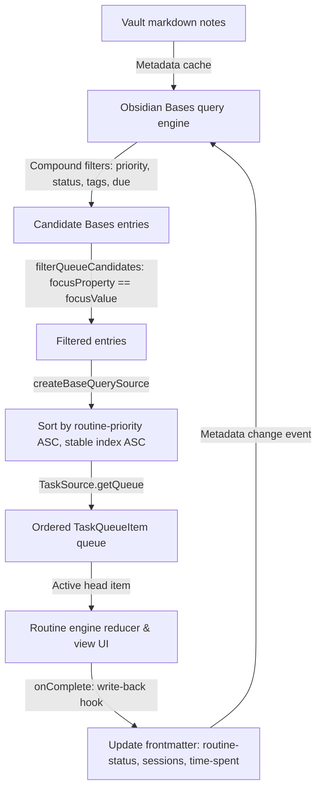

# Multi-property task queue filtering and priority dispatch

## Description

Knowledge workers manage tasks across multiple overlapping dimensions: urgency, project ownership, lifecycle status, scheduled due dates, and routine-specific dispatch priorities.
In Obsidian Bases, query views filter and sort vault notes using compound predicates combining multiple frontmatter properties.
Routine Flow builds on top of Obsidian Bases by mapping evaluated query entries into structured task queues (`TaskSource`).
A view option specifies target candidate properties (such as `focusProperty: note.status` matching `focusValue: in-progress`), while Routine Flow's queue generator inspects task frontmatter for execution metadata: `routine-priority`, `routine-status`, `routine-time-spent`, and `routine-last-cycled`.
Tasks are deterministically ordered by numeric `routine-priority` (ascending), ensuring critical items are dispatched before general tasks.
As routines progress, phase hooks write execution metrics back into note frontmatter, dynamically updating Bases filters in real time.

## Domain mapping

This workflow maps multi-property Bases queries and frontmatter metadata onto Routine Flow's queue filtering and priority dispatch pipeline.

### Frontmatter property schema

| Property | Type | Purpose | Evaluated by |
|---|---|---|---|
| `priority` | `number` (e.g. `1`, `2`, `3`) or `string` (`P1`, `P2`) | User-defined priority classification | Bases query filters (`note.priority == 1`) |
| `routine-priority` | `number` (e.g. `-100`, `1`, `10`) | Explicit dispatch rank in routine queue | `createBaseQuerySource` (`a.priority - b.priority`) |
| `status` | `string` (`todo`, `in-progress`, `done`) | High-level project workflow state | Bases view filters / `focusProperty` |
| `routine-status` | `string` (`pending`, `in_progress`, `completed`, `skipped`) | Routine lifecycle cycle status | `readCycleStatus` (`TaskQueueItem.cycleStatus`) |
| `routine-time-spent` | `string` (ISO 8601 duration e.g. `PT25M`) | Cumulative focus time logged in routine | `readTimeSpent` (`TaskQueueItem.timeSpent`) |
| `routine-last-cycled` | `string` (ISO 8601 instant) | Timestamp of last routine execution | `readLastCycledAt` (`TaskQueueItem.lastCycledAt`) |
| `type` | `string` (`work`, `bug-ticket`, `ultradian-task`) | Task domain categorization | `focusProperty` / `breakProperty` view options |
| `tags` | `string[]` (`feature`, `urgent`, `backend`) | Multi-tag classification | Bases compound query expressions |

### Bases multi-property views (`Priority-Queue.base`)

```yaml
type: base
properties:
  note.status:
    displayName: Status
  note.due:
    displayName: Due date
  note.priority:
    displayName: Priority level
  note.routine-priority:
    displayName: Routine priority
  note.sessions:
    displayName: Completed sessions
  note.type:
    displayName: Task type
  note.routine-status:
    displayName: Routine status
  note.severity:
    displayName: Severity
views:
  - type: routine-timer
    name: P1 urgent sprint focus
    routineFile: pomodoro/pomodoro-routine.md
    focusProperty: note.status
    focusValue: in-progress
  - type: routine-timer
    name: High priority bug blitz
    routineFile: bug-triage-blitz/bug-triage-blitz-routine.md
    focusProperty: note.type
    focusValue: bug-ticket
  - type: routine-timer
    name: Deep work top priority
    routineFile: ultradian-rhythm/ultradian-rhythm-routine.md
    focusProperty: note.type
    focusValue: ultradian-task
  - type: routine-timer
    name: Morning priority launch
    routineFile: morning-kickoff/morning-kickoff-routine.md
    focusProperty: note.type
    focusValue: morning-priority
  - type: table
    name: Task queue and priority status
  - type: bar-chart
    name: Sessions by priority
    xAxisProp: note.priority
    yAxisProp: note.sessions
    showLegend: true
  - type: pie-chart
    name: Routine status distribution
    xAxisProp: note.routine-status
    yAxisProp: note.sessions
    showLegend: true
```

### Queue hydration and dispatch pipeline



## Walk-through

1. **Query evaluation**: Obsidian Bases processes all notes in the vault, filtering candidate entries using base-level and view-level rules.
2. **Phase candidate filtering**: When a routine phase (e.g. `kind: 'focus'`) begins, `filterQueueCandidates` inspects the view configuration.
   It resolves `focusProperty` (`note.status`) and `focusValue` (`in-progress`), filtering the candidate list down to matching notes.
3. **Priority sorting**: `createBaseQuerySource` converts filtered `BaseQueryEntry` records into `TaskQueueItem` models.
   Each entry's frontmatter is checked for `routine-priority`.
   Entries with numeric values are sorted ascending; entries missing `routine-priority` or with non-numeric values default to `0`.
   Ties are broken stably by insertion index (`a.priority - b.priority || a.index - b.index`).
4. **Queue dispatch**: The top task item becomes the active item in `TaskSource.getQueue()`.
   The timer view renders the active task name in the header and displays the upcoming queue.
5. **Execution and write-back**: During timer execution, elapsed time accumulates in the active session.
   Upon phase completion, the `write-back` hook prompts for confirmation (or updates frontmatter directly).
   The target note's `routine-status` updates to `completed`, `routine-time-spent` increments, and `routine-last-cycled` records the current timestamp.
6. **Dynamic query refresh**: The metadata change triggers Obsidian Bases to re-evaluate its query.
   The completed task updates in the Bases table and charts, while the next highest priority task rotates to the front of the routine queue.

## Where it strains

- **Single property dispatch constraint in view options**: `RoutineTimerView`'s `getViewOptions` exposes a single `focusProperty` / `focusValue` pair per view.
  While the underlying Bases query can filter across multiple fields (`and: [note.priority == 1, note.status == 'ready']`), the in-view phase property filter only inspects one property.
- **String vs numeric priority semantics**: Many users specify priorities as strings (`P1`, `P2`, `High`, `Critical`), whereas `createBaseQuerySource` sorts using JavaScript numeric comparison.
  String priorities fall back to `0` in `readPriority`, relying exclusively on Bases-level sorting unless numeric `routine-priority` is explicitly provided.
- **Tag collection matching**: In Bases queries, tag matching checks array containment (`note.tags.contains('urgent')`).
  Routine Flow's `filterQueueCandidates` performs string equality (`valStr.toLowerCase() === targetVal.toLowerCase()`), so matching against multi-value frontmatter arrays requires preprocessing at the Bases query layer.
