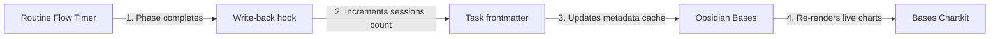

# Analytics and focus dashboards

Routine Flow integrates directly with Obsidian Bases and the [Bases Chartkit](https://github.com/mkobit/bases-chartkit) plugin to create rich focus dashboards.
By combining Routine Flow timer views with Chartkit data visualizations, you can track daily focus duration, session counts, and task throughput without leaving your workspace.

## Architecture

When a timed focus phase finishes, Routine Flow fires a `write-back` hook to persist session counts directly to the active task note's frontmatter.
Because Bases Chartkit continuously monitors Obsidian's metadata cache, all charts embedded in your workspace re-render immediately as new session data is recorded.



## Configuring a unified Base file

Define a `.base` file (such as `Dashboard.base`) containing property definitions, Routine Flow views, and Bases Chartkit chart views:

```yaml
type: base
properties:
  note.status:
    displayName: Status
  note.due:
    displayName: Due date
  note.priority:
    displayName: Priority
  note.sessions:
    displayName: Completed sessions
  note.type:
    displayName: Task type
  note.routine-status:
    displayName: Routine status
views:
  - type: routine-timer
    name: Pomodoro focus
    routineFile: pomodoro/pomodoro-routine.md
  - type: routine-timer
    name: Bug triage sprint
    routineFile: bug-triage-blitz/bug-triage-blitz-routine.md
  - type: routine-timer
    name: Shutdown ritual
    routineFile: shutdown-ritual/shutdown-ritual-routine.md
  - type: bar-chart
    name: Completed sessions by task
    xAxisProp: file.name
    yAxisProp: note.sessions
    showLegend: true
    filters:
      and:
        - note.sessions > 0
  - type: calendar-chart
    name: Focus activity calendar
    xAxisProp: note.due
    valueProp: note.sessions
    showLegend: true
  - type: pie-chart
    name: Sessions by status
    xAxisProp: note.status
    yAxisProp: note.sessions
    showLegend: true
  - type: table
    name: Task queue
```

## Embedding views in markdown dashboards

Obsidian markdown notes can embed individual views from `.base` files using the `![[FileName.base#ViewName]]` syntax.
This allows you to compose customized productivity dashboards that combine active timer controls, visual analytics, and task tables on a single page.

### Dashboard layout example

```markdown
# Daily focus and analytics dashboard

## Active routine

![[Dashboard.base#Pomodoro focus]]

---

## Focus metrics

### Completed sessions by task

![[Dashboard.base#Completed sessions by task]]

### Activity calendar

![[Dashboard.base#Focus activity calendar]]

### Session breakdown by status

![[Dashboard.base#Sessions by status]]

---

## Task queue

![[Dashboard.base#Task queue]]
```

## Real-time metrics flow

1. **Task binding**: Routine Flow selects an active work item matching the phase's `taskSourceId` (e.g. `type: work`).
2. **Interval completion**: When the countdown completes, `onComplete: "write-back"` increments the task's `sessions` frontmatter property.
3. **Confirmation prompt**: Routine Flow presents a write-back confirmation modal displaying the target note and updated value.
4. **Cache invalidation**: The confirmed update writes to disk, triggering an instant metadata cache refresh.
5. **Visual updates**: Bases Chartkit queries update automatically, displaying new bar heights, calendar heatmap density, and pie slices in real time.
