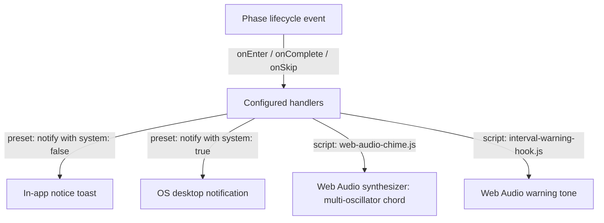

# Audio chimes and desktop notifications

Routine Flow pairs visual timer countdowns with synthesized audio chimes, milestone warning tones, and native OS desktop notifications.
Because the audio chimes use the standard Web Audio API, routines generate crisp harmonic tones in real time without downloading external audio files or relying on network connections.

## Notification and audio architecture

Routine Flow supports three complementary notification and feedback channels:

1. **In-app Obsidian notices**: Lightweight toast notifications rendered inside Obsidian via `new Notice()`.
2. **OS desktop system notifications**: Native operating system notifications that appear even when Obsidian is minimized or in the background.
3. **Web Audio synthesizer chimes**: Procedurally generated chords and warning alerts triggered directly on phase transition events (`onEnter`, `onComplete`, `onSkip`).



## Configuring notification policies

Routine phases can declare default notification settings directly in the routine definition:

```json
{
  "id": "focus",
  "name": "Focus interval",
  "duration": "PT25M",
  "notification": {
    "sound": "chime-start",
    "systemNotification": true
  }
}
```

- **`sound`**: Optional sound token or identifier associated with the phase.
- **`systemNotification`**: When set to `true`, phase start and completion events trigger OS-level desktop notifications.

## Phase transition handlers

Use `handlers` within your routine file to bind declarative presets or custom script hooks to phase lifecycle events:

```json
{
  "handlers": {
    "onEnter": [
      {
        "kind": "script",
        "scriptPath": "scripts/audio-chime-hook.js",
        "params": {
          "chord": "major",
          "baseFreq": 523.25
        }
      },
      {
        "kind": "preset",
        "preset": "notify",
        "params": {
          "title": "Routine Flow",
          "body": "Focus interval started — time for deep work",
          "system": false
        }
      }
    ],
    "onComplete": [
      {
        "kind": "script",
        "scriptPath": "scripts/audio-chime-hook.js",
        "params": {
          "chord": "fanfare",
          "baseFreq": 659.25
        }
      },
      {
        "kind": "preset",
        "preset": "notify",
        "params": {
          "title": "Routine Flow",
          "body": "Focus interval complete! Great work.",
          "system": true
        }
      },
      {
        "kind": "script",
        "scriptPath": "write-back"
      }
    ],
    "onSkip": [
      {
        "kind": "script",
        "scriptPath": "scripts/interval-warning-hook.js",
        "params": {
          "tone": "skip"
        }
      }
    ]
  }
}
```

## Web Audio synthesizer scripts

Vault-authored script hooks can synthesize musical tones using `AudioContext`, `OscillatorNode`, and `GainNode`.

### Polyphonic chord synthesizer (`scripts/audio-chime-hook.js`)

This hook generates a musical chord with a soft attack and natural exponential decay:

```javascript
const AudioContextClass = window.AudioContext || window.webkitAudioContext;
if (AudioContextClass) {
  const ctx = new AudioContextClass();
  const baseFreq = typeof context.params.baseFreq === 'number' ? context.params.baseFreq : 523.25;
  const chordType = typeof context.params.chord === 'string' ? context.params.chord : 'major';

  const intervals = chordType === 'fanfare'
    ? [1.0, 1.25, 1.5, 2.0]
    : chordType === 'restorative'
      ? [1.0, 1.333, 1.5]
      : chordType === 'soft'
        ? [1.0, 1.2]
        : [1.0, 1.25, 1.5];

  const now = ctx.currentTime;
  intervals.forEach((ratio, index) => {
    const osc = ctx.createOscillator();
    const gain = ctx.createGain();

    osc.type = 'sine';
    osc.frequency.setValueAtTime(baseFreq * ratio, now + index * 0.08);

    gain.gain.setValueAtTime(0.001, now + index * 0.08);
    gain.gain.exponentialRampToValueAtTime(0.2 / intervals.length, now + index * 0.08 + 0.02);
    gain.gain.exponentialRampToValueAtTime(0.0001, now + index * 0.08 + 0.8);

    osc.connect(gain);
    gain.connect(ctx.destination);

    osc.start(now + index * 0.08);
    osc.stop(now + index * 0.08 + 0.85);
  });
}

return [];
```

### Interval warning alert tone (`scripts/interval-warning-hook.js`)

This hook synthesizes an alert ping for skipped phases or milestone warnings:

```javascript
const AudioContextClass = window.AudioContext || window.webkitAudioContext;
if (AudioContextClass) {
  const ctx = new AudioContextClass();
  const tone = typeof context.params.tone === 'string' ? context.params.tone : 'warning';
  const freq = tone === 'skip' ? 329.63 : 880.0;
  const now = ctx.currentTime;

  const osc = ctx.createOscillator();
  const gain = ctx.createGain();

  osc.type = tone === 'skip' ? 'triangle' : 'sine';
  osc.frequency.setValueAtTime(freq, now);

  gain.gain.setValueAtTime(0.001, now);
  gain.gain.exponentialRampToValueAtTime(0.15, now + 0.02);
  gain.gain.exponentialRampToValueAtTime(0.0001, now + 0.35);

  osc.connect(gain);
  gain.connect(ctx.destination);

  osc.start(now);
  osc.stop(now + 0.4);
}

return [];
```

## Troubleshooting and tips

- **Audio context suspension**: If Obsidian has not received user interaction recently, modern browser engines may pause audio playback until a button click resumes the context.
- **Operating system notification permissions**: Ensure notifications are enabled for Obsidian in your system settings (Windows Notifications, macOS Notification Center, or Linux libnotify).
- **Distraction-free focus**: Set `system: false` on intermediate break phases to keep desktop notifications reserved for major focus completions and cycle resets.
