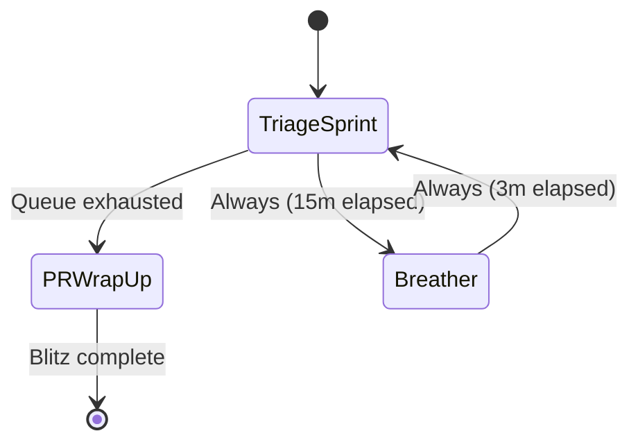

# Task triage, queues, and write-back

Routine Flow integrates with Obsidian Bases task queues to drive high-throughput triage workflows and automate note metadata logging.
This guide details bug triage blitzes with `queueExhausted` branch exits, batch chore processing, and frontmatter write-backs.

## Bug triage blitz

The bug triage blitz is designed for rapid issue resolution sprints.
It cycles 15-minute triage intervals with 3-minute breathers.
When the bug queue becomes empty, the routine automatically branches to a 10-minute PR wrap-up and submission phase.

### State diagram



### Routine configuration

```json
{
  "id": "bug-triage-blitz",
  "name": "Bug triage blitz",
  "phases": [
    {
      "id": "triage-sprint",
      "label": "Bug triage sprint",
      "kind": "focus",
      "duration": "PT15M",
      "taskSourceId": "bug-queue",
      "completionPolicy": null,
      "notification": null,
      "logTarget": { "kind": "activeItem" },
      "onEnter": null,
      "onComplete": "write-back",
      "onSkip": null,
      "onExit": null
    },
    {
      "id": "breather",
      "label": "Intermission breather",
      "kind": "break",
      "duration": "PT3M",
      "taskSourceId": null,
      "completionPolicy": null,
      "notification": null,
      "logTarget": { "kind": "activeItem" },
      "onEnter": null,
      "onComplete": null,
      "onSkip": null,
      "onExit": null
    },
    {
      "id": "wrap-up",
      "label": "PR wrap-up and submission",
      "kind": "ritual",
      "duration": "PT10M",
      "taskSourceId": null,
      "completionPolicy": { "kind": "manualClear" },
      "notification": null,
      "logTarget": { "kind": "activeItem" },
      "onEnter": null,
      "onComplete": null,
      "onSkip": null,
      "onExit": null
    }
  ],
  "transitions": [
    { "fromPhaseId": "triage-sprint", "toPhaseId": "wrap-up", "condition": { "kind": "queueExhausted" } },
    { "fromPhaseId": "triage-sprint", "toPhaseId": "breather", "condition": { "kind": "always" } },
    { "fromPhaseId": "breather", "toPhaseId": "triage-sprint", "condition": { "kind": "always" } }
  ]
}
```

### Automatic queue-exhausted exit

When `condition: { kind: "queueExhausted" }` is evaluated, the reducer checks if the bound `taskSourceId` has any remaining pending items.
If the queue is empty, the routine transitions to `wrap-up` rather than cycling back to `breather`.

---

## Batch chores and manual-clear workflows

For tasks that require variable execution time, use `completionPolicy: { kind: "manualClear" }`.
Unlike timed countdowns that advance automatically when the clock reaches zero, manual-clear phases stay active until explicitly concluded.

### Chore list routine

```json
{
  "id": "chore-list",
  "name": "Quick chores blitz",
  "phases": [
    {
      "id": "chore-item",
      "label": "Active chore",
      "kind": "focus",
      "duration": "PT10M",
      "taskSourceId": "chore-queue",
      "completionPolicy": { "kind": "manualClear" },
      "notification": null,
      "logTarget": { "kind": "activeItem" },
      "onEnter": null,
      "onComplete": "write-back",
      "onSkip": null,
      "onExit": null
    },
    {
      "id": "quick-break",
      "label": "Quick breather",
      "kind": "break",
      "duration": "PT2M",
      "taskSourceId": null,
      "completionPolicy": null,
      "notification": null,
      "logTarget": { "kind": "activeItem" },
      "onEnter": null,
      "onComplete": null,
      "onSkip": null,
      "onExit": null
    }
  ],
  "transitions": [
    { "fromPhaseId": "chore-item", "toPhaseId": "quick-break", "condition": { "kind": "always" } },
    { "fromPhaseId": "quick-break", "toPhaseId": "chore-item", "condition": { "kind": "always" } }
  ]
}
```

---

## Frontmatter write-back logging

Routine Flow can mutate markdown frontmatter in real time when phases complete.
When a phase with `onComplete: "write-back"` completes, the plugin prompts to record session metrics directly to the note.

### Supported write-back fields

- `sessions`: Increments the total completed session count (e.g. `sessions: 3` becomes `sessions: 4`).
- `status`: Optionally updates status from `in-progress` to `done`.
- `last-session`: Records the ISO timestamp of the completed interval.
- `routine-status`: Tracks progress through multi-phase pipelines (`active`, `done`, `skipped`).

### Confirmation modal

To prevent accidental vault modifications, write-backs trigger an inline confirmation modal showing the proposed diff.
Users can accept the changes with a single keystroke (`Enter`) or cancel (`Escape`).
