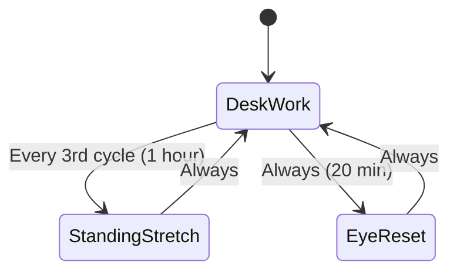
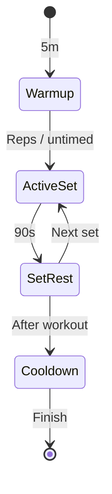

# Desk breaks and physical movement

Sedentary screen time causes eye strain, postural fatigue, and cognitive sluggishness.
Routine Flow provides ergonomic micro-breaks, physical stretches, and workout interval timers.

## Ergonomic 20-20-20 desk micro-movement

The 20-20-20 rule prompts users to look at an object 20 feet away for 20 seconds every 20 minutes.
This routine runs continuous 20-minute desk intervals, triggering a 20-second eye reset on normal cycles and escalating to a 2-minute posture stretch every third cycle (hourly).

### State diagram



### Routine configuration

```json
{
  "id": "desk-micro-movement",
  "name": "Desk micro-movement and eye reset",
  "phases": [
    {
      "id": "desk-work",
      "label": "Desk work",
      "kind": "focus",
      "duration": "PT20M",
      "taskSourceId": null,
      "completionPolicy": null,
      "notification": null,
      "logTarget": { "kind": "activeItem" },
      "onEnter": null,
      "onComplete": null,
      "onSkip": null,
      "onExit": null
    },
    {
      "id": "eye-reset",
      "label": "20-20-20 eye reset",
      "kind": "break",
      "duration": "PT20S",
      "taskSourceId": null,
      "completionPolicy": null,
      "notification": null,
      "logTarget": { "kind": "activeItem" },
      "onEnter": null,
      "onComplete": null,
      "onSkip": null,
      "onExit": null
    },
    {
      "id": "standing-stretch",
      "label": "Mobility and posture stretch",
      "kind": "break",
      "duration": "PT2M",
      "taskSourceId": null,
      "completionPolicy": null,
      "notification": null,
      "logTarget": { "kind": "activeItem" },
      "onEnter": null,
      "onComplete": null,
      "onSkip": null,
      "onExit": null
    }
  ],
  "transitions": [
    { "fromPhaseId": "desk-work", "toPhaseId": "standing-stretch", "condition": { "kind": "everyNth", "n": 3 } },
    { "fromPhaseId": "desk-work", "toPhaseId": "eye-reset", "condition": { "kind": "always" } },
    { "fromPhaseId": "eye-reset", "toPhaseId": "desk-work", "condition": { "kind": "always" } },
    { "fromPhaseId": "standing-stretch", "toPhaseId": "desk-work", "condition": { "kind": "always" } }
  ]
}
```

---

## Standalone guided stretch break

A stretch break routine runs standalone without attaching to a task queue (`taskSourceId: null`).

### Walk-through

- **Neck and shoulder release (60s)**: Gentle lateral flexions and chin tucks.
- **Wrist and forearm stretch (60s)**: Extensor and flexor stretches to combat typing tension.
- **Spinal twist and thoracic opening (90s)**: Torso rotation and chest openers.

---

## Workout interval circuit

Workout routines structure exercise sets, rest intervals, and warmups.
Phases can specify fixed countdown durations or rely on manual completion for rep-based exercises.

### State diagram



### Rep-based exercises without durations

For weightlifting or bodyweight exercises where completion is counted by repetitions rather than seconds, configure `"duration": null` on `active-set`.
The timer will await manual advance before starting the timed recovery countdown.

---

## Lifestyle routines: dog walk and lunch recharge

Routine Flow coordinates everyday lifestyle activities directly from your Obsidian workspace:

- **Midday dog walk**: 20-minute outdoor stroll providing fresh air and sunshine.
- **Mindful lunch recharge**: 30-minute screen-free meal break followed by a 10-minute post-lunch walk.
