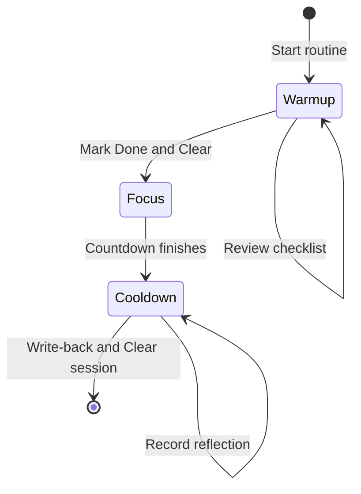
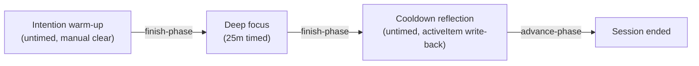

# Focus sandwich routine

The focus sandwich routine structures deep work sessions into three sequential phases: an untimed intention-setting warm-up, a timed deep focus block, and an untimed cooldown reflection with frontmatter write-back to active task notes.
By enclosing intensive focus intervals between mindful entry and exit phases, the routine mitigates context switching and captures task progress directly in your vault.

## Workflow rationale

High-leverage cognitive work often falters during the transitions immediately preceding and following focus intervals.
Without deliberate warm-up, individuals risk jumping into complex problems before clearing distractions, setting concrete scope, or assembling prerequisites.
Similarly, concluding deep focus abruptly without cooldown capture leads to lost insights, uncommitted context, and inaccurate session metrics.

The focus sandwich pattern resolves these friction points:

1. **Intention warm-up**: Untimed preparation to inspect task notes, review checklist items, eliminate interruptions, and define session scope.
2. **Deep focus**: A fixed countdown block (e.g. 25 minutes) guarded from distractions and backed by timer notifications.
3. **Cooldown reflection**: An untimed closure phase prompting immediate reflection and writing completed session tallies directly into the task frontmatter.

## State machine topology

The focus sandwich workflow follows a linear directed phase graph with manual clear controls on untimed boundary phases:





## Routine schema definition

The routine configuration note defines three phases with transition edges and write-back hooks:

```markdown
---
is-routine: true
---

# Focus sandwich routine

```json
{
  "id": "focus-sandwich",
  "name": "Focus sandwich",
  "phases": [
    {
      "id": "warmup",
      "label": "Intention warm-up",
      "kind": "warmup",
      "duration": null,
      "taskSourceId": "focus-queue",
      "completionPolicy": {
        "kind": "manualClear"
      },
      "handlers": {
        "onEnter": [
          {
            "kind": "preset",
            "preset": "notify",
            "params": {
              "title": "Focus sandwich",
              "body": "Clarify intention and prepare focus task",
              "system": false
            }
          }
        ]
      }
    },
    {
      "id": "focus",
      "label": "Deep focus",
      "kind": "focus",
      "duration": "PT25M",
      "taskSourceId": "focus-queue",
      "notification": {
        "sound": "chime-start",
        "systemNotification": true
      }
    },
    {
      "id": "cooldown",
      "label": "Cooldown reflection",
      "kind": "cooldown",
      "duration": null,
      "taskSourceId": "focus-queue",
      "completionPolicy": {
        "kind": "manualClear"
      },
      "logTarget": {
        "kind": "activeItem"
      },
      "handlers": {
        "onComplete": [
          {
            "kind": "script",
            "scriptPath": "write-back"
          }
        ]
      }
    }
  ],
  "transitions": [
    {
      "fromPhaseId": "warmup",
      "toPhaseId": "focus",
      "condition": {
        "kind": "always"
      }
    },
    {
      "fromPhaseId": "focus",
      "toPhaseId": "cooldown",
      "condition": {
        "kind": "always"
      }
    }
  ]
}
```
```

## Phase breakdown and behaviors

### 1. Intention warm-up (`warmup`)

- **Duration**: `null` (untimed).
- **Completion policy**: `manualClear`.
- **Purpose**: Gives you unlimited time to prepare without a ticking clock inducing premature urgency.
- **Actions**: Select an active task from the queue, review warm-up checklists, silence incoming alerts, and clarify the deliverable.
- **Transition**: Clicking **Done** and **Clear** advances the routine directly to the deep focus countdown.

### 2. Deep focus (`focus`)

- **Duration**: `PT25M` (25 minutes).
- **Completion policy**: `autoAdvance`.
- **Notification**: Chime and desktop notification alert you when the interval concludes.
- **Purpose**: Dedicated single-task execution.
- **Transition**: When the countdown completes, Routine Flow automatically advances the runner to the cooldown phase.

### 3. Cooldown reflection (`cooldown`)

- **Duration**: `null` (untimed).
- **Log target**: `{ kind: "activeItem" }`.
- **Completion policy**: `manualClear`.
- **Handlers**: The built-in `write-back` hook runs on `onComplete`.
- **Purpose**: Review what was accomplished, record lingering thoughts or blockers, and confirm frontmatter updates.
- **Transition**: Clicking **Done** presents the write-back modal to commit notes and increment session counts on the active task note.

## Obsidian Bases configuration

To drive the focus sandwich routine directly from Obsidian Bases, configure a routine-timer view in your base file:

```yaml
type: base
properties:
  note.status:
    displayName: Status
  note.due:
    displayName: Due date
  note.priority:
    displayName: Priority
  note.sessions:
    displayName: Completed sessions
views:
  - type: routine-timer
    name: Focus sandwich
    routineFile: focus-sandwich/focus-sandwich-routine.md
```

When opened in an Obsidian workspace pane, the view renders queue items, execution dials, phase transition buttons, and write-back dialogs matching your vault configuration.
