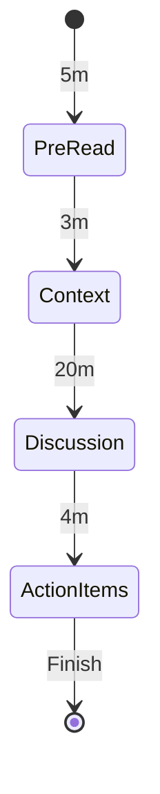
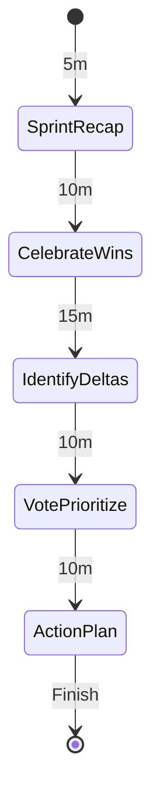

# Meeting agendas and retrospectives

Routine Flow is not limited to cyclic timers; it also orchestrates linear, finite agendas for team meetings and personal checkpoints.
This guide details silent meeting structures, agile sprint retrospectives, and standup pacing.

## Amazon-style silent meeting

Silent meetings replace slide presentations with a shared briefing document read in silence at the start of the meeting.
This ensures all participants review the material before discussing decisions and assigning action items.

### State diagram



### Routine configuration

```json
{
  "id": "silent-meeting",
  "name": "Silent meeting agenda",
  "phases": [
    {
      "id": "pre-read",
      "label": "Silent pre-read",
      "kind": "review",
      "duration": "PT5M",
      "taskSourceId": null,
      "completionPolicy": null,
      "notification": null,
      "logTarget": { "kind": "activeItem" },
      "onEnter": null,
      "onComplete": null,
      "onSkip": null,
      "onExit": null
    },
    {
      "id": "context",
      "label": "Context framing",
      "kind": "discussion",
      "duration": "PT3M",
      "taskSourceId": null,
      "completionPolicy": null,
      "notification": null,
      "logTarget": { "kind": "activeItem" },
      "onEnter": null,
      "onComplete": null,
      "onSkip": null,
      "onExit": null
    },
    {
      "id": "discussion",
      "label": "Open discussion",
      "kind": "discussion",
      "duration": "PT20M",
      "taskSourceId": null,
      "completionPolicy": { "kind": "manualClear" },
      "notification": null,
      "logTarget": { "kind": "activeItem" },
      "onEnter": null,
      "onComplete": null,
      "onSkip": null,
      "onExit": null
    },
    {
      "id": "action-items",
      "label": "Action items and owners",
      "kind": "discussion",
      "duration": "PT4M",
      "taskSourceId": null,
      "completionPolicy": { "kind": "manualClear" },
      "notification": null,
      "logTarget": { "kind": "activeItem" },
      "onEnter": null,
      "onComplete": null,
      "onSkip": null,
      "onExit": null
    }
  ],
  "transitions": [
    { "fromPhaseId": "pre-read", "toPhaseId": "context", "condition": { "kind": "always" } },
    { "fromPhaseId": "context", "toPhaseId": "discussion", "condition": { "kind": "always" } },
    { "fromPhaseId": "discussion", "toPhaseId": "action-items", "condition": { "kind": "always" } }
  ]
}
```

### Walk-through

1. **Silent pre-read (5m)**: Participants read the proposal note in silence and leave inline comments or questions.
2. **Context framing (3m)**: The meeting host summarizes the primary decision required and clarifies initial questions.
3. **Open discussion (20m)**: Attendees debate major trade-offs and resolve conflicting feedback.
4. **Action items (4m)**: The facilitator records direct owners and due dates before concluding the session.

---

## Agile sprint retrospective

Sprint retrospectives follow structured reflection phases to extract actionable continuous improvements.
Facilitators can advance through stages manually or rely on phase countdowns to keep time.

### State diagram



### Routine configuration

```json
{
  "id": "sprint-retrospective",
  "name": "Sprint retrospective",
  "phases": [
    {
      "id": "recap",
      "label": "Sprint metric recap",
      "kind": "review",
      "duration": "PT5M",
      "taskSourceId": null,
      "completionPolicy": null,
      "notification": null,
      "logTarget": { "kind": "activeItem" },
      "onEnter": null,
      "onComplete": null,
      "onSkip": null,
      "onExit": null
    },
    {
      "id": "wins",
      "label": "Celebrate wins",
      "kind": "discussion",
      "duration": "PT10M",
      "taskSourceId": null,
      "completionPolicy": null,
      "notification": null,
      "logTarget": { "kind": "activeItem" },
      "onEnter": null,
      "onComplete": null,
      "onSkip": null,
      "onExit": null
    },
    {
      "id": "deltas",
      "label": "Identify deltas and blockers",
      "kind": "discussion",
      "duration": "PT15M",
      "taskSourceId": null,
      "completionPolicy": null,
      "notification": null,
      "logTarget": { "kind": "activeItem" },
      "onEnter": null,
      "onComplete": null,
      "onSkip": null,
      "onExit": null
    },
    {
      "id": "action-plan",
      "label": "Action planning",
      "kind": "ritual",
      "duration": "PT10M",
      "taskSourceId": null,
      "completionPolicy": { "kind": "manualClear" },
      "notification": null,
      "logTarget": { "kind": "activeItem" },
      "onEnter": null,
      "onComplete": null,
      "onSkip": null,
      "onExit": null
    }
  ],
  "transitions": [
    { "fromPhaseId": "recap", "toPhaseId": "wins", "condition": { "kind": "always" } },
    { "fromPhaseId": "wins", "toPhaseId": "deltas", "condition": { "kind": "always" } },
    { "fromPhaseId": "deltas", "toPhaseId": "action-plan", "condition": { "kind": "always" } }
  ]
}
```

---

## Standup turn pacing

Standup routines allocate structured time for team members or personal morning updates.
Each speaker answers what was accomplished yesterday, the plan for today, and any active blockers.

### Configuration highlights

- Set short 2-minute durations per participant.
- Use `completionPolicy: { kind: "noOp" }` so queue notes persist across consecutive standup cycles.
- Advance immediately using keyboard shortcuts or on-screen controls when a speaker finishes early.
