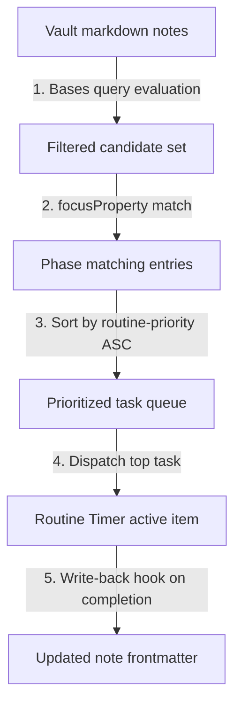

# Multi-property task filtering and priority dispatch

Routine Flow integrates with Obsidian Bases to filter, rank, and dispatch tasks using multi-dimensional metadata.
By combining tag expressions, priority levels, folder hierarchies, and lifecycle status fields, you can configure fine-grained task queues for specialized focus routines.

## Filtering architecture

Task dispatch in Routine Flow operates in two complementary stages:

1. **Obsidian Bases query filtering**: Bases evaluates compound boolean predicates (`and`, `or`, `not`) across note properties like `tags`, `status`, `priority`, `folder`, and `due`.
2. **Routine Flow candidate selection and priority sorting**: When a routine phase activates, Routine Flow matches notes against `focusProperty` and `focusValue`, then orders candidates ascending by numeric `routine-priority`.



## Frontmatter metadata schema

To drive multi-property filtering and dispatch, task notes can include standard and routine-specific frontmatter fields:

```yaml
---
title: Refactor authentication boundary
type: work
status: in-progress
priority: 1
routine-priority: 10
routine-status: pending
tags:
  - backend
  - security
  - urgent
due: 2026-08-25
sessions: 2
routine-time-spent: PT50M
routine-last-cycled: "2026-08-21T14:30:00Z"
---
```

### Property descriptions

- **`priority`**: High-level task urgency or importance (e.g. `1`, `2`, `3` or `P1`, `P2`, `P3`) evaluated in Bases filters.
- **`routine-priority`**: Numeric ordering key evaluated by Routine Flow (lower numbers sort first; unranked notes default to `0`).
- **`status`**: Project lifecycle status (e.g. `todo`, `in-progress`, `done`) used by Bases views and `focusProperty`.
- **`routine-status`**: Lifecycle cycle status within Routine Flow (`pending`, `in_progress`, `completed`, `skipped`).
- **`routine-time-spent`**: Cumulative ISO 8601 focus duration logged during routine runs.
- **`routine-last-cycled`**: ISO 8601 timestamp recorded when a routine completes or skips the task.

## Bases queue configuration (`Priority-Queue.base`)

Configure dedicated Routine Flow views alongside table and chart views in a `.base` file:

```yaml
type: base
properties:
  note.status:
    displayName: Status
  note.due:
    displayName: Due date
  note.priority:
    displayName: Priority level
  note.routine-priority:
    displayName: Routine priority
  note.sessions:
    displayName: Completed sessions
  note.type:
    displayName: Task type
  note.routine-status:
    displayName: Routine status
  note.severity:
    displayName: Severity
views:
  - type: routine-timer
    name: P1 urgent sprint focus
    routineFile: pomodoro/pomodoro-routine.md
    focusProperty: note.status
    focusValue: in-progress
  - type: routine-timer
    name: High priority bug blitz
    routineFile: bug-triage-blitz/bug-triage-blitz-routine.md
    focusProperty: note.type
    focusValue: bug-ticket
  - type: routine-timer
    name: Deep work top priority
    routineFile: ultradian-rhythm/ultradian-rhythm-routine.md
    focusProperty: note.type
    focusValue: ultradian-task
  - type: routine-timer
    name: Morning priority launch
    routineFile: morning-kickoff/morning-kickoff-routine.md
    focusProperty: note.type
    focusValue: morning-priority
  - type: table
    name: Task queue and priority status
  - type: bar-chart
    name: Sessions by priority
    xAxisProp: note.priority
    yAxisProp: note.sessions
    showLegend: true
  - type: pie-chart
    name: Routine status distribution
    xAxisProp: note.routine-status
    yAxisProp: note.sessions
    showLegend: true
```

## Embedding dispatch views in notes

Embed the configured dispatch views into a central dashboard or daily planning note:

```markdown
# Priority task dispatch dashboard

## Top priority sprint focus
![[Priority-Queue.base#P1 urgent sprint focus]]

## High severity bug blitz
![[Priority-Queue.base#High priority bug blitz]]

## Deep work queue
![[Priority-Queue.base#Deep work top priority]]

## Queue overview and metrics
![[Priority-Queue.base#Task queue and priority status]]
![[Priority-Queue.base#Sessions by priority]]
```

## Dispatch patterns

### 1. Tag-scoped focus lanes

Filter tasks by domain tags (e.g. `#frontend`, `#research`, `#docs`) to create dedicated routine instances for distinct context modes.

### 2. Severity triage with terminal wrap-up

Combine bug ticket filters with a `queueExhausted` routine topology (such as `Bug triage blitz`) to automatically conclude triage sprints when the high-priority queue is empty.

### 3. Progressive priority ladder

Use negative `routine-priority` values (e.g. `-100`, `-10`) to explicitly jump critical blockers to the front of the queue ahead of zero-defaulted tasks.
