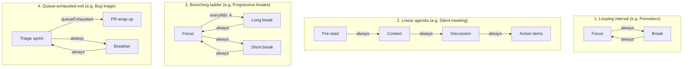

# Routine topology patterns

Routine Flow models all workflows as directed phase graphs.
A routine consists of discrete phases connected by conditional transition edges.
This architecture supports everything from classic repeating timers to linear meeting agendas and event-driven task queues.

## Core domain primitives

Every routine definition combines six modular building blocks:

- **`Phase`**: A single timed or untimed segment with an explicit `kind` (`focus`, `break`, `ritual`, `review`, `discussion`), label, and duration.
- **`TransitionCondition`**: The rule governing edge traversal when a phase concludes, such as `always`, `everyNth`, `queueExhausted`, or `custom`.
- **`TaskSource`**: An Obsidian Bases query binding that feeds active task notes into a phase (e.g. `focus-queue`, `break-queue`, or `null` for standalone phases).
- **`CompletionPolicy`**: Dictates what happens to an active queue item upon phase completion (e.g. `manualClear`, `noOp`).
- **`LogTarget`**: Specifies how session metrics are attributed (`activeItem` targeting the current task note or `callback`).
- **`Hook`**: Lifecycle triggers (`onEnter`, `onComplete`, `onSkip`, `onExit`) that run actions like frontmatter write-backs or notification chimes.

## Topological archetypes

Routine configurations generally fall into four primary topological archetypes:

## Catalog of routine topologies

The following reference guides detail real-world topologies available in the test suite and example vault:

| Topology group | Routines covered | Key features |
| :--- | :--- | :--- |
| [Focus and interval rhythms](pomodoro-and-ultradian) | Pomodoro, Ultradian 90/20, Variable breaks | `everyNth` branching, 90-minute ultradian cycles, short/medium/long ladders |
| [Meeting agendas and retrospectives](linear-meeting-agendas) | Silent meeting, Sprint retrospective, Standup | Linear non-looping agendas, facilitator checkpoints, turn pacing |
| [Shutdown rituals and daily kickoffs](shutdown-and-daily-rituals) | Workday shutdown, Morning kickoff, Evening wind-down | Untimed manual-clear closure, habit checklists, daily note planning |
| [Desk breaks and physical movement](desk-breaks-and-movement) | Desk micro-movement, Stretch break, Workout, Dog walk | 20-20-20 eye strain reset, rep-based phases, non-queue standalone routines |
| [Task triage and frontmatter write-backs](bug-triage-and-batching) | Bug triage blitz, Chore list, Spaced repetition, Write-back variants | `queueExhausted` conditional exits, frontmatter metadata write-backs |

## Routine note format

Routine definitions are stored in markdown notes as JSON code blocks or YAML frontmatter.
Obsidian Bases views reference routines using the `routineFile` option.
This decouples the visual timer view from the underlying routine topology, allowing multiple views to share a single routine definition.
