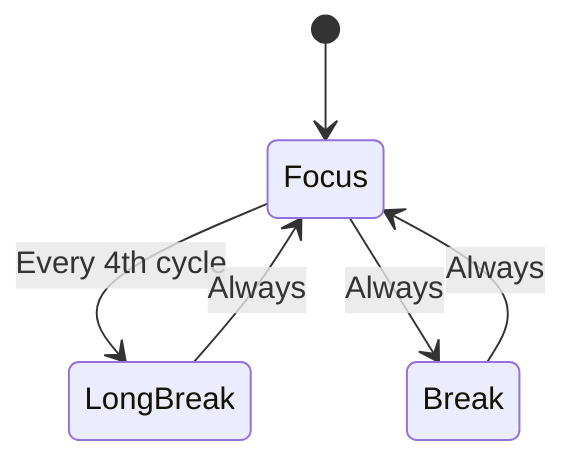
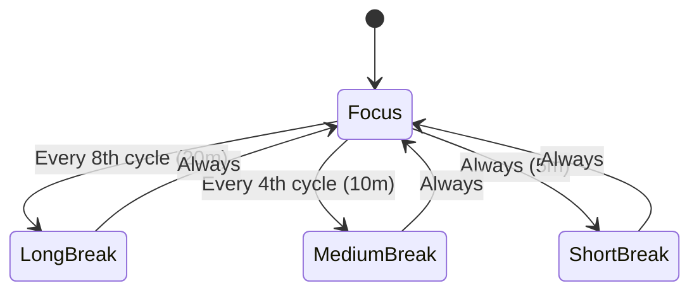
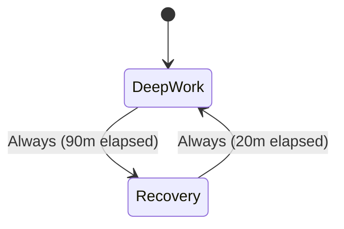

# Focus and interval rhythms

Focus and interval rhythms structure cognitive work by alternating periods of high-intensity focus with intentional recovery breaks.
This guide details the standard Pomodoro workflow, progressive break ladders, and the 90/20 ultradian rhythm.

## Standard Pomodoro

The classic Pomodoro technique alternates 25 minutes of work with a 5-minute break.
Every fourth focus session, the break extends to 15 minutes to support deeper recovery.

### State diagram



### Routine configuration

```json
{
  "id": "pomodoro",
  "name": "Pomodoro",
  "phases": [
    {
      "id": "focus",
      "label": "Focus",
      "kind": "focus",
      "duration": "PT25M",
      "taskSourceId": "focus-queue",
      "completionPolicy": null,
      "notification": null,
      "logTarget": { "kind": "activeItem" },
      "onEnter": null,
      "onComplete": "write-back",
      "onSkip": null,
      "onExit": null
    },
    {
      "id": "break",
      "label": "Short break",
      "kind": "break",
      "duration": "PT5M",
      "taskSourceId": "break-queue",
      "completionPolicy": null,
      "notification": null,
      "logTarget": { "kind": "activeItem" },
      "onEnter": null,
      "onComplete": null,
      "onSkip": null,
      "onExit": null
    },
    {
      "id": "long-break",
      "label": "Long break",
      "kind": "break",
      "duration": "PT15M",
      "taskSourceId": "break-queue",
      "completionPolicy": null,
      "notification": null,
      "logTarget": { "kind": "activeItem" },
      "onEnter": null,
      "onComplete": null,
      "onSkip": null,
      "onExit": null
    }
  ],
  "transitions": [
    { "fromPhaseId": "focus", "toPhaseId": "long-break", "condition": { "kind": "everyNth", "n": 4 } },
    { "fromPhaseId": "focus", "toPhaseId": "break", "condition": { "kind": "always" } },
    { "fromPhaseId": "break", "toPhaseId": "focus", "condition": { "kind": "always" } },
    { "fromPhaseId": "long-break", "toPhaseId": "focus", "condition": { "kind": "always" } }
  ]
}
```

### Task queue binding

The `focus` phase consumes task notes via `taskSourceId: "focus-queue"`.
In Obsidian Bases, create a table view filtered for `status = "todo"` and `type = "work"`.
The active item advances automatically when marked done or upon manual completion.

---

## Variable break duration ladders

Variable break ladders generalize the single long-break concept into a multi-tier recovery schedule.
Transition evaluation is order-dependent: the reducer checks the first matching edge from top to bottom.

### State diagram



### Transition rules

In the routine file, place the highest-frequency rule first to ensure proper priority matching:

```json
[
  { "fromPhaseId": "focus", "toPhaseId": "long-break", "condition": { "kind": "everyNth", "n": 8 } },
  { "fromPhaseId": "focus", "toPhaseId": "medium-break", "condition": { "kind": "everyNth", "n": 4 } },
  { "fromPhaseId": "focus", "toPhaseId": "short-break", "condition": { "kind": "always" } }
]
```

---

## Ultradian 90/20 rhythm

The ultradian rhythm technique aligns deep cognitive focus with natural human biological cycles.
Research into ultradian rhythms suggests that peak brain performance lasts approximately 90 minutes before requiring 20 minutes of downtime.

### State diagram



### Routine configuration

```json
{
  "id": "ultradian-rhythm",
  "name": "Ultradian 90/20 rhythm",
  "phases": [
    {
      "id": "deep-work",
      "label": "Ultradian deep work",
      "kind": "focus",
      "duration": "PT90M",
      "taskSourceId": "ultradian-queue",
      "completionPolicy": { "kind": "manualClear" },
      "notification": null,
      "logTarget": { "kind": "activeItem" },
      "onEnter": null,
      "onComplete": "write-back",
      "onSkip": null,
      "onExit": null
    },
    {
      "id": "recovery",
      "label": "Cognitive recovery",
      "kind": "break",
      "duration": "PT20M",
      "taskSourceId": null,
      "completionPolicy": null,
      "notification": null,
      "logTarget": { "kind": "activeItem" },
      "onEnter": null,
      "onComplete": null,
      "onSkip": null,
      "onExit": null
    }
  ],
  "transitions": [
    { "fromPhaseId": "deep-work", "toPhaseId": "recovery", "condition": { "kind": "always" } },
    { "fromPhaseId": "recovery", "toPhaseId": "deep-work", "condition": { "kind": "always" } }
  ]
}
```

### Best practices for ultradian sessions

- Reserve ultradian blocks for complex architectural design, programming, or long-form writing.
- Keep recovery periods screen-free to allow cognitive rejuvenation.
- Pair with `manualClear` so tasks remain active until explicitly marked complete.
