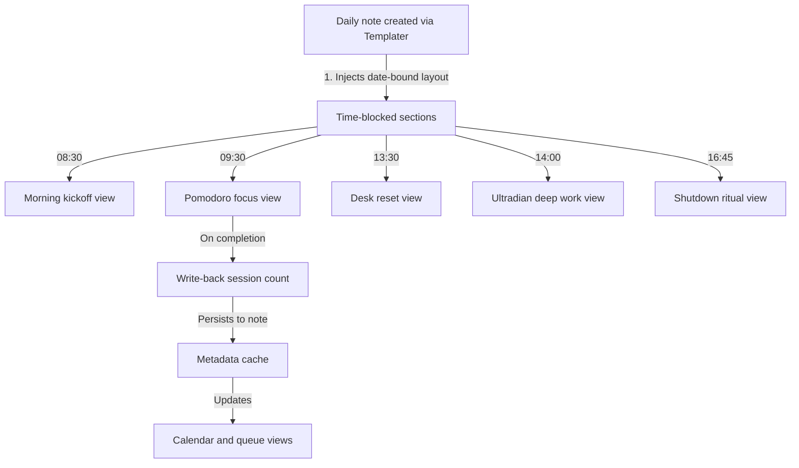

# Recurring routines and calendar scheduling

Routine Flow pairs with Obsidian Daily Notes, Templater, and calendar plugins to run scheduled routines throughout the workday.
By embedding routine timer views directly into daily note templates, you can link time-blocked calendar intervals to executable phase graphs.

## Architecture

Daily notes act as the daily execution hub.
Templater creates the daily log file with date stamps, embeds Routine Flow views for each scheduled block, and binds task queues to tasks scheduled for the day.



## Daily routine Base configuration

Define a `.base` file (such as `Daily-Routines.base`) with views corresponding to each recurring time block:

```yaml
type: base
properties:
  note.status:
    displayName: Status
  note.due:
    displayName: Due date
  note.priority:
    displayName: Priority
  note.sessions:
    displayName: Completed sessions
  note.type:
    displayName: Task type
  note.routine-status:
    displayName: Routine status
  note.scheduled-time:
    displayName: Scheduled time
views:
  - type: routine-timer
    name: Morning kickoff
    routineFile: morning-kickoff/morning-kickoff-routine.md
  - type: routine-timer
    name: Pomodoro focus block
    routineFile: pomodoro/pomodoro-routine.md
  - type: routine-timer
    name: Ultradian deep work
    routineFile: ultradian-rhythm/ultradian-rhythm-routine.md
  - type: routine-timer
    name: Desk micro-movement
    routineFile: desk-micro-movement/desk-micro-movement-routine.md
  - type: routine-timer
    name: Shutdown ritual
    routineFile: shutdown-ritual/shutdown-ritual-routine.md
  - type: routine-timer
    name: Evening wind down
    routineFile: evening-wind-down/evening-wind-down-routine.md
  - type: table
    name: Today's schedule
  - type: calendar-chart
    name: Calendar timeline
    xAxisProp: note.due
    valueProp: note.sessions
    showLegend: true
```

## Templater daily note template

Use a Templater template to generate your daily note with embedded Routine Flow views:

```markdown
---
title: "<% tp.file.title %>"
date: "<% tp.date.now("YYYY-MM-DD") %>"
type: daily-note
tags:
  - daily-log
  - routine-flow
---

# Daily schedule: <% tp.date.now("dddd, MMMM D, YYYY") %>

## Daily task queue and calendar overview

![[Daily-Routines.base#Today's schedule]]

![[Daily-Routines.base#Calendar timeline]]

---

## 08:30 - 09:00 · Morning kickoff

![[Daily-Routines.base#Morning kickoff]]

---

## 09:30 - 12:00 · Morning focus block (Pomodoro)

![[Daily-Routines.base#Pomodoro focus block]]

---

## 13:30 - 13:45 · Midday reset

![[Daily-Routines.base#Desk micro-movement]]

---

## 14:00 - 16:00 · Deep work block (Ultradian)

![[Daily-Routines.base#Ultradian deep work]]

---

## 16:45 - 17:15 · Workday shutdown ritual

![[Daily-Routines.base#Shutdown ritual]]

---

## 21:30 - 22:00 · Evening wind down

![[Daily-Routines.base#Evening wind down]]
```

## Daily execution lifecycle

1. **Morning initialization**: Creating the daily note resolves Templater variables and presents the day's schedule.
2. **Morning kickoff**: Running `Morning kickoff` walks through schedule review, top 3 task prioritization, and deep work setup.
3. **Time-blocked focus execution**: During scheduled focus intervals, embedded Pomodoro and Ultradian timers execute focus and recharge cycles.
4. **Task progress logging**: As focus phases finish, write-back hooks record completed session counts on active task frontmatter.
5. **Workday closure**: The `Shutdown ritual` walks through communication triage, accomplishment logging, and tomorrow's planning before clearing the untimed workspace tidy phase.
