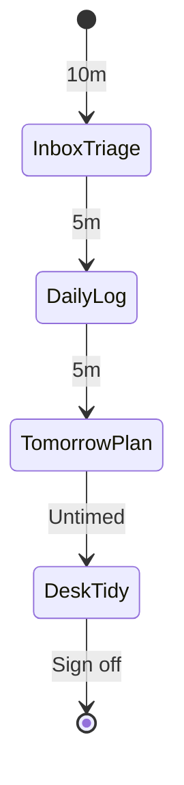
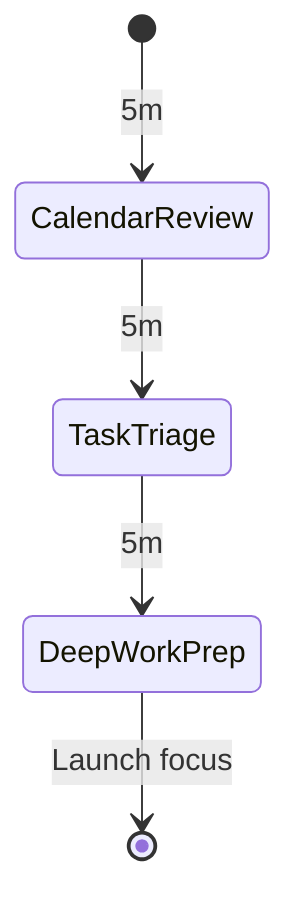

# Shutdown rituals and daily kickoffs

Daily startup and shutdown rituals establish clear boundaries between focused work and personal recovery.
This guide details structured workday shutdown routines, morning kickoffs, and evening wind-down sequences.

## Workday shutdown ritual

A consistent shutdown ritual prevents open cognitive loops and burnout by closing all active work threads before leaving the desk.
The workflow combines timed triage steps with an untimed terminal tidy-up phase.

### State diagram



### Routine configuration

```json
{
  "id": "shutdown-ritual",
  "name": "Workday shutdown ritual",
  "phases": [
    {
      "id": "inbox-triage",
      "label": "Inbox and notification triage",
      "kind": "ritual",
      "duration": "PT10M",
      "taskSourceId": null,
      "completionPolicy": null,
      "notification": null,
      "logTarget": { "kind": "activeItem" },
      "onEnter": null,
      "onComplete": null,
      "onSkip": null,
      "onExit": null
    },
    {
      "id": "daily-log",
      "label": "Daily log summary",
      "kind": "ritual",
      "duration": "PT5M",
      "taskSourceId": null,
      "completionPolicy": { "kind": "manualClear" },
      "notification": null,
      "logTarget": { "kind": "activeItem" },
      "onEnter": null,
      "onComplete": "write-back",
      "onSkip": null,
      "onExit": null
    },
    {
      "id": "tomorrow-plan",
      "label": "Tomorrow plan and priorities",
      "kind": "ritual",
      "duration": "PT5M",
      "taskSourceId": null,
      "completionPolicy": { "kind": "manualClear" },
      "notification": null,
      "logTarget": { "kind": "activeItem" },
      "onEnter": null,
      "onComplete": null,
      "onSkip": null,
      "onExit": null
    },
    {
      "id": "desk-tidy",
      "label": "Workspace tidy and shutdown sign-off",
      "kind": "ritual",
      "duration": null,
      "taskSourceId": null,
      "completionPolicy": { "kind": "manualClear" },
      "notification": null,
      "logTarget": { "kind": "activeItem" },
      "onEnter": null,
      "onComplete": null,
      "onSkip": null,
      "onExit": null
    }
  ],
  "transitions": [
    { "fromPhaseId": "inbox-triage", "toPhaseId": "daily-log", "condition": { "kind": "always" } },
    { "fromPhaseId": "daily-log", "toPhaseId": "tomorrow-plan", "condition": { "kind": "always" } },
    { "fromPhaseId": "tomorrow-plan", "toPhaseId": "desk-tidy", "condition": { "kind": "always" } }
  ]
}
```

### Untimed terminal phases

Notice that the `desk-tidy` phase specifies `"duration": null`.
Untimed phases do not count down.
The timer displays an open status until the user clicks the finish button or triggers manual advancement.

---

## Morning kickoff ritual

The morning kickoff routine prepares your workspace and priorities for high-impact deep work.

### State diagram



### Routine configuration

```json
{
  "id": "morning-kickoff",
  "name": "Morning kickoff",
  "phases": [
    {
      "id": "calendar-review",
      "label": "Review schedule and commitments",
      "kind": "review",
      "duration": "PT5M",
      "taskSourceId": null,
      "completionPolicy": null,
      "notification": null,
      "logTarget": { "kind": "activeItem" },
      "onEnter": null,
      "onComplete": null,
      "onSkip": null,
      "onExit": null
    },
    {
      "id": "task-triage",
      "label": "Select top 3 focus priorities",
      "kind": "review",
      "duration": "PT5M",
      "taskSourceId": null,
      "completionPolicy": { "kind": "manualClear" },
      "notification": null,
      "logTarget": { "kind": "activeItem" },
      "onEnter": null,
      "onComplete": null,
      "onSkip": null,
      "onExit": null
    },
    {
      "id": "deep-work-prep",
      "label": "Workspace and tool setup",
      "kind": "ritual",
      "duration": "PT5M",
      "taskSourceId": null,
      "completionPolicy": { "kind": "manualClear" },
      "notification": null,
      "logTarget": { "kind": "activeItem" },
      "onEnter": null,
      "onComplete": null,
      "onSkip": null,
      "onExit": null
    }
  ],
  "transitions": [
    { "fromPhaseId": "calendar-review", "toPhaseId": "task-triage", "condition": { "kind": "always" } },
    { "fromPhaseId": "task-triage", "toPhaseId": "deep-work-prep", "condition": { "kind": "always" } }
  ]
}
```

---

## Evening wind-down

The evening wind-down routine initiates a low-stimulation period before sleep.

### Walk-through

- **Screen-off transition (5m)**: Shut down work computers, close laptops, and dock mobile devices away from the bed.
- **Journaling and reflection (10m)**: Capture fleeting thoughts or personal notes in your daily log note.
- **Relaxation reading (15m)**: Read physical books or engage in offline stretching.
